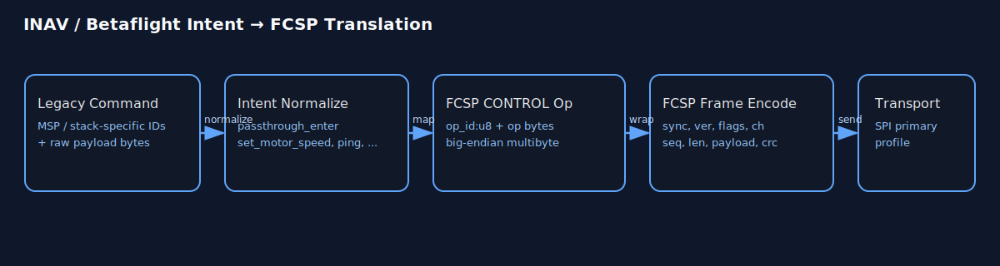
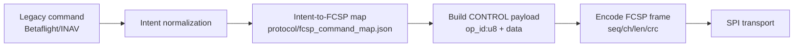

# FCSP Command Translation (INAV/Betaflight → FCSP)

This document defines how legacy flight stack intents are translated into FCSP commands for both Python and C++ codepaths.

## Quick visual

Text-based graphic (preferred):

See standalone text asset: `assets/fcsp_command_translation.txt`

```text
FCSP Command Translation (INAV/Betaflight -> FCSP)

+-----------------------------+
| Legacy Command              |
| MSP / stack-specific IDs    |
| + raw payload bytes         |
+-------------+---------------+
      |
      | normalize
      v
+-----------------------------+
| Internal Intent             |
| e.g. passthrough_enter      |
|      set_motor_speed        |
|      ping                   |
+-------------+---------------+
      |
      | map
      v
+-----------------------------+
| FCSP CONTROL payload        |
| op_id:u8 + op-specific data |
| multi-byte values: big-end. |
+-------------+---------------+
      |
      | wrap
      v
+-----------------------------+
| FCSP frame                  |
| sync/ver/fl/ch/seq/len/...  |
| payload + crc16             |
+-------------+---------------+
      |
      | transport
      v
    SPI (primary profile)
```

Optional SVG version:



_Figure: Legacy Betaflight/INAV command intent normalized and mapped into FCSP CONTROL payload + FCSP frame over SPI._

Alternate compact text graphic:

```text
┌─────────────────────────────┐
│ Betaflight / INAV command   │
│ (legacy ID + payload)       │
└──────────────┬──────────────┘
         │ normalize
         ▼
┌─────────────────────────────┐
│ Internal Intent             │
│ e.g. set_motor_speed        │
└──────────────┬──────────────┘
         │ map
         ▼
┌─────────────────────────────┐
│ FCSP CONTROL op             │
│ op + op-specific bytes      │
└──────────────┬──────────────┘
         │ wrap
         ▼
┌─────────────────────────────┐
│ FCSP Frame                  │
│ sync/ver/fl/ch/seq/len/...  │
└──────────────┬──────────────┘
         │ transport
         ▼
    SPI (primary profile)
```

Mermaid flow:



## Canonical artifacts

- Machine-readable map: `protocol/fcsp_command_map.json`
- Python adapter: `sim/python_fcsp/command_adapter.py`
- C++ scaffold: `firmware/serv8/fcsp_command_adapter.hpp` *(legacy folder name; does not imply active embedded soft-CPU usage)*

## Why intent-based mapping

Legacy command IDs can vary by stack/version. Translating by **feature intent** keeps behavior stable:

- passthrough enter/exit
- esc scan
- set motor speed
- ping/link status

## FCSP mapping rules

- Use `channel=CONTROL` for command/reply operations.
- Control payload format is always:
  - `op_id:u8 + op_specific_bytes`
- Encode all multi-byte fields big-endian.

## Current covered intents

- `passthrough_enter` → `CONTROL/PT_ENTER`
- `passthrough_exit` → `CONTROL/PT_EXIT`
- `esc_scan` → `CONTROL/ESC_SCAN`
- `set_motor_speed` → `CONTROL/SET_MOTOR_SPEED`
- `get_link_status` → `CONTROL/GET_LINK_STATUS`
- `ping` → `CONTROL/PING`

## Usage pattern

1. Parse legacy command into internal intent + parameters.
2. Use adapter to build FCSP control payload.
3. Wrap with FCSP frame encoder.
4. Send over FCSP transport (SPI primary profile).

## Scope note

This translation layer maps **intent** to FCSP. It does not modify FCSP transport semantics.
