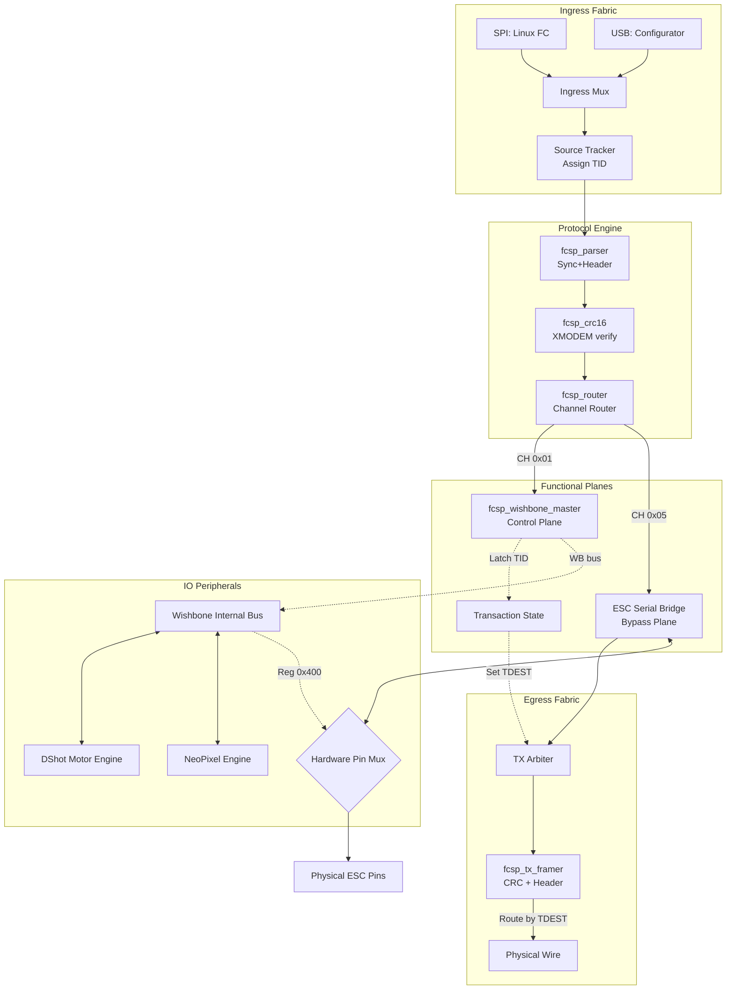

# FPGA Block Design — Pure Hardware FCSP Offloader (54 MHz)

This document defines the FCSP/1 offloader architecture and block responsibilities.

## Implementation Status

- **Active control-plane handler:** `fcsp_wishbone_master` in `fcsp_offloader_top.sv`.
- **Channel 0x05 (ESC_SERIAL):** Full TX/RX path wired through `fcsp_io_engines` → `wb_esc_uart` → `fcsp_stream_packetizer`.
- **SPI TX egress:** Disabled. All responses exit via USB-UART.
- `fcsp_serv_bridge` is legacy dead code — no longer instantiated.

> **Complete implementation status and gap tracking:** [DESIGN.md](DESIGN.md) §12

## Design Goals

- **Deterministic Control Path**: Maximum deterministic performance and minimal control-plane jitter.
- **Hardware-Native Passthrough**: Sub-microsecond latency for ESC configuration.
- **Unified Command Routing**: Single RTL logic path for both SPI (Flight Controller) and USB (PC/Configurator) ingress.
- **Wishbone Interior Bus**: Standardized memory-mapped access to all IO engines.

---

## Top-Level Architecture

The design acts as a high-speed hardware switch. Packets are parsed at the "Ingress" and routed either to the **Control Plane** (Wishbone) or the **Bypass Plane** (Direct Pin Access).

---

## Block Responsibilities

### 1) Ingress Priority Mux & Transports
- **SPI Frontend**: Maps physical SPI pins to a 54MHz byte stream.
- **UART Byte Stream**: Maps the onboard USB-UART to a 54MHz byte stream (Configurator Path).
- **Mux**: Automatically selects the active source to feed the main protocol parser.

### 2) `fcsp_parser` & `fcsp_crc16`
- Identifies the `0xA5` sync byte and extracts frame version, channel, and length.
- Validates every frame using CRC16-XMODEM. 
- **Latency**: Fully pipelined.

### 3) `fcsp_router`
- Directs payload bytes to the correct hardware handler based on the channel ID:
  - **Channel 0x01 (CONTROL)**: Routed to the Wishbone Master.
  - **Channel 0x05 (ESC_SERIAL)**: Routed to the physical pin switch.

### 4) Control Plane Handler\n- `fcsp_wishbone_master` directly executes `WRITE_BLOCK` / `READ_BLOCK` ops on the Wishbone bus.

### 5) `fcsp_io_engines`
- Implements the registers for DShot speeds, NeoPixel colors, ESC UART, PWM decoder, and the **Hardware Pin Mux**.
- Address decode is handled by `wb_io_bus` using `wbm_adr_i[15:8]` as page select.

See `docs/DESIGN.md` §3–4 for the complete address map and per-peripheral register maps.

---

## Hardware-Native Passthrough (The Switch)

Unlike previous designs where a CPU copied bytes between UARTs, this design uses a **hard-wired bypass**.

1. **Selection**: Host writes `0` to Register `0x40000400` Bit 0.
2. **Action**: The `PIN_MUX` physically disconnects the DShot pulse generator.
3. **Link**: The selected Motor Pin is wired directly to the `ESC_SERIAL` (0x05) stream.
4. **Timing**: The "Switch Over" happens in exactly 1 clock cycle (18.5ns), providing the perfect deterministic timing required for ESC bootloader entry.

## Stateful Routing & Return-Path Tracking

The design implements a **stateful switch** model to support multiple hosts (USB and SPI) simultaneously.

- **TID (Transaction ID)**: At ingress, each frame is tagged with its source port ID.
- **Latching**: The processing module (e.g., WB Master) latches the `TID` for the duration of its task.
- **TDEST (Destination)**: The response stream inherits the latched `TID` as its `TDEST`, ensuring the egress logic routes the frame back to the correct physical port.

This mechanism allows a PC Configurator (USB) to monitor registers or flash ESCs without interfering with the Flight Controller's (SPI) control loop.

---

## Control Register Map

Access via FCSP Channel `0x01` (`WRITE_BLOCK` / `READ_BLOCK`).

> **Canonical register map:** [DESIGN.md](DESIGN.md) §4–5 — complete address map and per-peripheral register definitions.

**Key page addresses (quick reference):**

| Page `[15:8]` | Peripheral |
|---------------|------------|
| `0x00` | WHO_AM_I (`0xFC500002`) |
| `0x01` | PWM Decoder (6-ch) |
| `0x03` | DShot Controller (4-ch) |
| `0x04` | Serial/DShot Mux |
| `0x06` | NeoPixel (8-pixel) |
| `0x09` | ESC UART (half-duplex) |
| `0x0C` | LED Controller |

---

## Timing and Performance
- **Clock Frequency**: 54 MHz (Verified).
- **Control Latency**: Zero-software overhead. Register updates are instantaneous.
- **Throughput**: Maximum utilization of SPI and 1Mbaud USB links.
- **Deterministic**: No OS interrupts or CPU stalls can effect actuator timing.