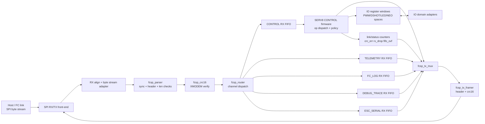

# FPGA Block Design — FCSP Offloader (SERV8 @ 50 MHz)

This document defines the initial FPGA block architecture for FCSP/1 on the offloader path.

Design goals:

- deterministic FCSP byte-stream handling over SPI
- RTL-owned frame fast-path (sync/len/CRC/routing/FIFO)
- SERV8 firmware-owned control policy/state/result codes
- migration-safe behavior parity with MSP baseline workflows

---

## Top-level architecture

Canonical quick-reference diagram lives in:

- `docs/TOP_LEVEL_BLOCK_DIAGRAM.md`

The diagram below is an expanded architectural view that should stay semantically aligned with the canonical top-level diagram.

---

## Block responsibilities

### 1) `spi_frontend`

- Converts SPI transfers into a continuous RX byte stream and TX byte source/sink.
- Must support split-frame and multi-frame bursts.
- No FCSP semantics here.

### 2) `fcsp_parser`

- Searches for sync byte `0xA5`.
- Parses FCSP header (`version`, `flags`, `channel`, `seq`, `payload_len`).
- Enforces payload length maximum.
- Emits candidate frame bytes/metadata to CRC block.
- On malformed header/length, shift by 1 byte and resync.

### 3) `fcsp_crc16`

- Computes CRC16/XMODEM across `version..payload`.
- Compares with frame CRC field.
- Accepts/denies frame; increments error counters on failure.

### 4) `fcsp_router`

- Routes validated frames into per-channel RX FIFOs:
  - CONTROL (`0x01`)
  - TELEMETRY (`0x02`)
  - FC_LOG (`0x03`)
  - DEBUG_TRACE (`0x04`)
  - ESC_SERIAL (`0x05`)
- Handles FIFO-full backpressure/drop policy (deterministic + counted).

### 5) Channel FIFOs (`fcsp_rx_fifo_*`, `fcsp_tx_fifo_*`)

- Isolate producer/consumer timing.
- Carry frame boundaries (`sof/eof` or length-tagged packets).
- Target aggregate depth >= 4 KB equivalent across RX/TX queues.

### 6) `serv_control_dispatch` (firmware)

- Dequeues CONTROL channel frames.
- Dispatches `op_id` and builds deterministic result responses.
- Owns passthrough safety/state transitions.

Initial op priority:

1. `PING`, `GET_LINK_STATUS`
2. `HELLO`, `GET_CAPS`
3. `PT_ENTER`, `PT_EXIT`, `ESC_SCAN`
4. `SET_MOTOR_SPEED`
5. `READ_BLOCK`, `WRITE_BLOCK`

### 7) `io_space_windows`

- Shared register window abstraction for block IO spaces:
  - `0x10` PWM_IO
  - `0x11` DSHOT_IO
  - `0x12` LED_IO
  - `0x13` NEO_IO
- Enforces bounds checks and deterministic error return.

DSHOT mode compatibility requirement:

- Preserve legacy runtime mode support through `DSHOT_IO` control window.
- Required baseline modes: `150`, `300`, `600`.
- Include `1200` when enabled by selected legacy engine path.
- Mode changes must be guarded to avoid mid-frame glitches.

### 8) `fcsp_tx_mux` + `fcsp_tx_framer`

- Muxes outbound traffic from firmware responses and streaming channels.
- Applies QoS priority (recommended: CONTROL highest).
- Builds FCSP wire frames and appends CRC16.

---

## Internal interfaces (recommended)

Use a simple valid/ready stream for bytes and a packetized stream for frames.

### Byte-stream interface

- `rx_byte[7:0]`
- `rx_valid`, `rx_ready`

### Frame-stream interface

- `frm_valid`, `frm_ready`
- `frm_channel[7:0]`
- `frm_flags[7:0]`
- `frm_seq[15:0]`
- `frm_len[15:0]`
- `frm_data[7:0]` + `frm_data_valid` + `frm_data_last`

### Status/counter interface

- `ctr_crc_error`
- `ctr_len_error`
- `ctr_sync_loss`
- `ctr_rx_drop`
- `ctr_fifo_overflow`

---

## Clock/reset and timing notes

- Single clock domain target to start: `clk_50m`.
- Synchronous active-high reset: `rst`.
- If SPI clock is asynchronous, isolate with front-end CDC FIFO before parser.
- Keep parser+CRC pipeline one-byte-per-cycle capable in nominal case.

---

## CONTROL path state machine (firmware-owned)

Core states:

- `IDLE`
- `PT_ACTIVE(motor_index, esc_count)`
- `ERROR_RECOVERY`

Rules:

1. `PT_ENTER` transitions `IDLE -> PT_ACTIVE` on success.
2. `PT_EXIT` transitions `PT_ACTIVE -> IDLE`.
3. `SET_MOTOR_SPEED` rejected while `PT_ACTIVE` (busy/not_ready policy).
4. Transport/frame errors surface as deterministic FCSP result/status.

---

## Verification decomposition (block-first)

Required standalone block tests before integration:

1. `fcsp_parser`: sync find, length reject, split/multi-frame stream handling
2. `fcsp_crc16`: known vectors + fail path
3. `fcsp_router`: per-channel routing + overflow behavior
4. FIFO wrappers: depth, watermark, boundary semantics
5. CONTROL dispatcher: op decode/result mapping + passthrough state logic
6. Block IO windows: bounds checks, read/write correctness

Then subsystem tests:

- parser + crc + router chain
- control request/response latency determinism
- cross-transport semantic equivalence in sim harness

---

## Implementation order (practical)

1. `fcsp_parser` + `fcsp_crc16` RTL skeletons
2. `fcsp_router` + per-channel RX FIFOs
3. SERV control dispatcher with `PING`, `GET_LINK_STATUS`, `HELLO`, `GET_CAPS`
4. passthrough ops and safety gating
5. `READ_BLOCK`/`WRITE_BLOCK` spaces for IO windows
6. TX mux/framer priority + telemetry/log streaming

This sequence satisfies protocol gates while reducing integration risk.