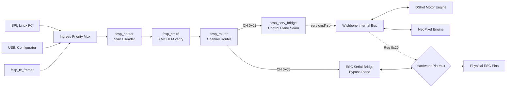

# FPGA Block Design — Pure Hardware FCSP Offloader (54 MHz)

This document defines the FCSP/1 offloader architecture and block responsibilities.

## Implementation Status

- Current top-level integration (`fcsp_offloader_top.sv`) uses `fcsp_serv_bridge` as the active control-plane seam.
- `fcsp_wishbone_master.sv` exists and remains the direct-control target path, but is not the active top-level integration path in this revision.

## Design Goals

- **Deterministic Control Path**: Maximum deterministic performance and minimal control-plane jitter.
- **Hardware-Native Passthrough**: Sub-microsecond latency for ESC configuration.
- **Unified Command Routing**: Single RTL logic path for both SPI (Flight Controller) and USB (PC/Configurator) ingress.
- **Wishbone Interior Bus**: Standardized memory-mapped access to all IO engines.

---

## Top-Level Architecture

The design acts as a high-speed hardware switch. Packets are parsed at the "Ingress" and routed either to the **Control Plane** (Wishbone) or the **Bypass Plane** (Direct Pin Access).

---

## Block Responsibilities

### 1) Ingress Priority Mux & Transports
- **SPI Frontend**: Maps physical SPI pins to a 54MHz byte stream.
- **UART Byte Stream**: Maps the onboard USB-UART to a 54MHz byte stream (Configurator Path).
- **Mux**: Automatically selects the active source to feed the main protocol parser.

### 2) `fcsp_parser` & `fcsp_crc16`
- Identifies the `0xA5` sync byte and extracts frame version, channel, and length.
- Validates every frame using CRC16-XMODEM. 
- **Latency**: Fully pipelined.

### 3) `fcsp_router`
- Directs payload bytes to the correct hardware handler based on the channel ID:
  - **Channel 0x01 (CONTROL)**: Routed to the Wishbone Master.
  - **Channel 0x05 (ESC_SERIAL)**: Routed to the physical pin switch.

### 4) Control Plane Handler
- **Current**: `fcsp_serv_bridge` is integrated in top-level and carries FCSP control payloads to/from SERV stream interfaces.
- **Target**: `fcsp_wishbone_master` path for direct `WRITE_BLOCK` / `READ_BLOCK` execution.

### 5) `fcsp_io_engines`
- Implements the registers for DShot speeds, NeoPixel colors, and the **Hardware Switch**.
- **Reg 0x00 / 0x04**: DShot motor words.
- **Reg 0x20**: Mode Control (The Switch). Controls the physical `PIN_MUX`.

---

## Hardware-Native Passthrough (The Switch)

Unlike previous designs where a CPU copied bytes between UARTs, this design uses a **hard-wired bypass**.

1. **Selection**: Host writes `1` to Register `0x20`.
2. **Action**: The `PIN_MUX` physically disconnects the DShot pulse generator.
3. **Link**: The selected Motor Pin is wired directly to the `ESC_SERIAL` (0x05) stream.
4. **Timing**: The "Switch Over" happens in exactly 1 clock cycle (18.5ns), providing the perfect deterministic timing required for ESC bootloader entry.

---

## Control Register Map

Access via FCSP Channel `0x01` (`WRITE_BLOCK` / `READ_BLOCK`).

Addressing note: this table uses **relative offsets**. Some docs show absolute bus addresses (`0x4000xxxx`) for the same registers.

| Address | Register | Description |
|---------|----------|-------------|
| 0x0000  | DShot 0-1 | High-resolution motor speed words for Motors 0 & 1 |
| 0x0004  | DShot 2-3 | High-resolution motor speed words for Motors 2 & 3 |
| 0x0010  | NeoPixel | 24-bit RGB value for status LEDs |
| 0x0020  | Mode Select | **The Switch**: bit[0]=Mode, bit[2:1]=Channel, bit[4]=Force Low |

---

## Timing and Performance
- **Clock Frequency**: 54 MHz (Verified).
- **Control Latency**: Zero-software overhead. Register updates are instantaneous.
- **Throughput**: Maximum utilization of SPI and 1Mbaud USB links.
- **Deterministic**: No OS interrupts or CPU stalls can effect actuator timing.