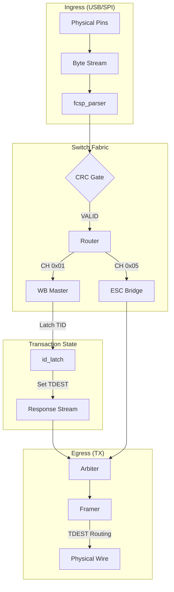

# FCSP Switch Architecture & AXIS Mapping

This document details the architectural model of the `rt-fc-offloader`. The system is designed as a **Stateful Hardware Switch** rather than a traditional CPU-driven peripheral. This ensures deterministic, low-latency data movement across multiple physical transports (USB, SPI) and internal functional planes.

---

## 1. The Switch Analogy

The FCSP offloader functions like a networking switch. It does not "process" data in the traditional sense; it **routes** frames based on metadata and **tracks state** to ensure replies find their way back to the correct source.

| Switch Concept | FCSP Offloader Implementation |
| :--- | :--- |
| **Ingress Port** | USB or SPI physical interface. |
| **MAC Address** | **TID (Transaction ID)**: An internal sideband ID used to identify the frame source. |
| **Parsing** | `fcsp_parser`: Identifies frame boundaries (`sync`) and extracts header info. |
| **Validation** | `fcsp_crc_gate`: Buffers the frame and drops it if the CRC16-XMODEM is invalid. |
| **Switch Fabric** | `fcsp_router`: Demuxes the stream into different "channels" (Control, ESC, Telemetry). |
| **Egress Port** | `fcsp_tx_arbiter` + `fcsp_tx_framer`: Multiplexes results and routes them based on **TDEST**. |

---

## 2. AXI-Stream (AXIS) Mapping

The internal data movement uses a standardized AXI-Stream interface. This allows us to use standard flow control and modularize the processing blocks.

### 2.1 Standard AXIS Signals
- **TVALID / TREADY**: Handshaking. Every byte is flow-controlled. If the TX wire is busy, backpressure travels all the way back to the Ingress.
- **TDATA**: The payload byte.
- **TLAST**: Crucial. Marks the end of a protocol frame. Our state machines and CRC checkers rely on `TLAST` to conclude operations.

### 2.2 Routing Sidebands
- **TDEST (Destination)**: Ingress uses `TDEST` to specify which **System Channel** (e.g., 0x01 for Wishbone) a frame is intended for. Egress uses `TDEST` to specify which **Physical Port** (0: USB, 1: SPI) a response should exit on.
- **TID (Transaction ID)**: Used for **Return-Path Tracking**. When a frame enters the system, it is tagged with a `TID` representing the source interface.

---

## 3. Stateful Return-Path Tracking

Since AXI-Stream is inherently unidirectional, how does a "reply" know where to go? We implement **Source ID Latching**.

1. **At Ingress**: When `fcsp_parser` detects a new frame, the top-level logic samples the active source (USB vs SPI) and assigns a `TID`.
2. **At Processing**: Modules like `fcsp_wishbone_master` **latch** this `TID` while they process the command.
3. **At Egress**: When the response is generated, the module sets its outgoing `TDEST` to the latched `TID`.
4. **At Arbiter**: The `fcsp_tx_arbiter` captures this `TDEST` and uses it to route the final framed packet to the correct physical wire (USB UART or SPI MISO).

---

## 4. Addressing "Simple" Design Issues

To maintain high architectural quality and pass strict Verilator linting, following patterns are enforced across the design:

### 4.1 Typing: `logic` Only
Avoid `wire` and `reg`. Use `logic` for all ports and internal signals.
- **Why?** `logic` allows both continuous and procedural assignments. Using `wire` for an `output` that is procedurally assigned inside an `always` block (common in state machines) triggers `PROCASSWIRE` errors in Verilator.

### 4.2 Combinational Safety: Default Assignments
Every `always_comb` block **must** have a default assignment for every signal it drives at the very top of the block.
- **Why?** Incomplete `if/else` or `case` statements in combinational logic create **inferred latches**, which cause timing issues and hardware instability. Verilator will flag these as `LATCH` warnings.

### 4.3 FSM Robustness: Payload Draining
State machines that handle protocol frames must never assume a "Happy Path" payload length.
- **Pattern**: If an operation (like `OP_PING`) does not require a payload but the frame contains one, the FSM must enter a `ST_DISCARD_CMD` state to drain the bytes until `TLAST` before sending a response.
- **Why?** Leaving undrained bytes in a FIFO will corrupt the next frame, leading to system-wide desynchronization.

---

## 5. Architectural Flow Chart

