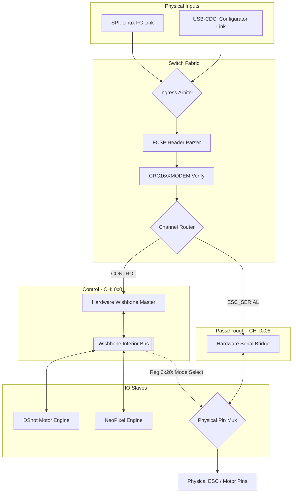

# Pure Hardware Offloader System Overview

## Architecture

The system is a high-speed, CPU-less FPGA offloader designed to bridge a Flight Controller (Linux via SPI) or an ESC Configurator (PC via USB) to motor and LED actuators. It uses the **Flight Controller Serial Protocol (FCSP)** for unified communication.

### Key Design Feature: Hardware-Native Switching
This design eliminates the RISC-V processor entirely. Packet parsing, routing, and register control are handled by dedicated RTL state machines, ensuring deterministic, low-latency performance.

## Unified Wishbone Bus

All internal peripherals are controlled via a standard Wishbone bus. The **Hardware Wishbone Master** parses FCSP `WRITE_BLOCK` and `READ_BLOCK` commands and executes 32-bit bus cycles.

| Address | Peripheral       | Access | Description                                  |
|---------|------------------|--------|----------------------------------------------|
| 0x0000  | DShot Words 0-1  | RW     | 16-bit DShot values for Motors 0 and 1       |
| 0x0004  | DShot Words 2-3  | RW     | 16-bit DShot values for Motors 2 and 3       |
| 0x0010  | NeoPixel RGB     | RW     | 24-bit RGB value for the NeoPixel strip      |
| 0x0020  | Mode Register    | RW     | **The Switch**: Controls Passthrough Mode    |

### Mode Register (0x0020) bitfields:
- **Bit [0]**: `mux_sel` - `0`: DShot Mode, `1`: Serial Passthrough Mode.
- **Bits [2:1]**: `mux_ch` - Selects which ESC channel (0-3) to bridge for serial.
- **Bit [4]**: `force_low` - Forces the output LOW (used for BLHeli **Break Signal**).

## Operating Modes

### 1. Flight Mode (DShot)
The FPGA generates high-speed pulses based on the DShot Words registers. All 4 motors are updated simultaneously. This matches the performance of dedicated PIO state machines in the Raspberry Pi Pico 2.

### 2. Passthrough Mode (ESC Configurator)
The hardware pins are physically switched to the **Serial Tunnel**. 
- **Latency**: Sub-microsecond (Pure RTL bypass).
- **Direct Link**: The PC (USB) communicates directly with the ESC bootloader.
- **Timing Control**: The host script can precisely control the **Break Signal** by toggling bit 4 of the Mode Register.

## Comparison to Legacy Design
The previous design relied on the **SERV RISC-V CPU** to copy bytes between UARTs. This was slow (~1ms latency) and required complex firmware. The new **Pure Hardware Switch** removes the CPU, saving 4KB of BRAM and providing nanosecond-level switching.
