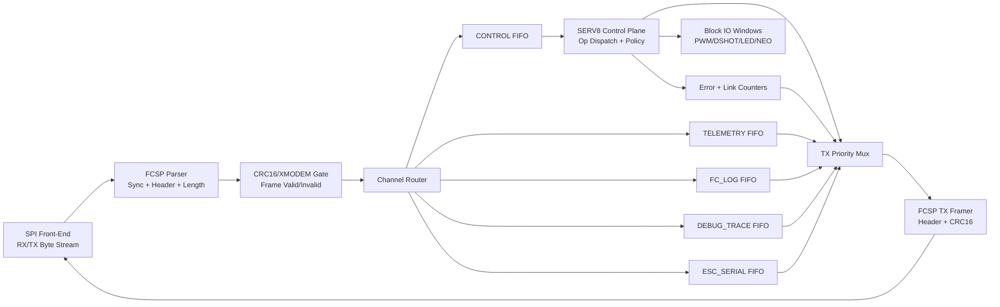

# Top-Level FPGA Block Diagram (FCSP Hot Path)

This is the quick-reference top-level view for the FCSP offloader architecture.

Use this as the canonical top-level block diagram for FPGA datapath/control reviews.

Related docs:

- `docs/FPGA_BLOCK_DESIGN.md` (expanded architecture details)
- `external/python-imgui-esc-configurator/docs/architecture.md` (historical/supporting context in submodule)

## Key rule

- **Hot SPI path is RTL-only** (`Parser -> CRC -> Router -> FIFOs`).
- **SERV is not in raw-byte path**; it handles validated CONTROL frames and policy.

## Minimal interface boundary

- RTL-to-SERV handoff happens at channel FIFOs using complete frame payload context.
- SERV returns response payloads to TX path through `TX Priority Mux` + `TX Framer`.
