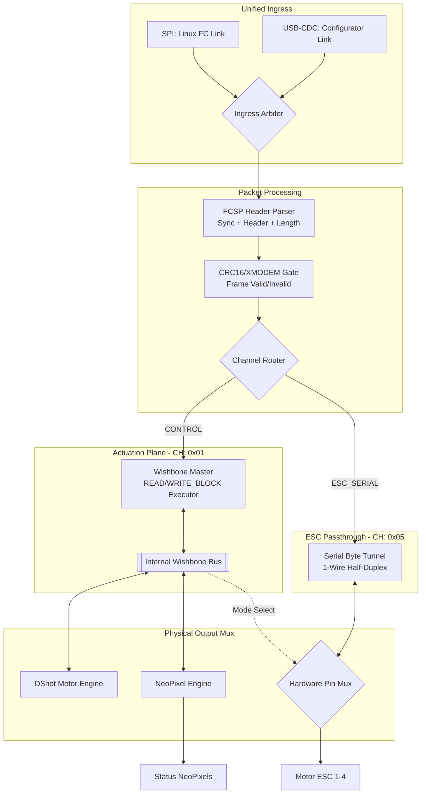

# Top-Level FPGA Block Diagram (Pure Hardware FCSP)

This is the canonical architectural view for the **CPU-less** FCSP offloader. All functions are performed in high-speed RTL gates at 54 MHz.

## Functional Principles

### 1) Deterministic Control
Command execution (Channel `0x01`) is handled by a state machine that translates FCSP packets directly into Wishbone bus cycles. There is **no software jitter** or interrupt latency.

### 2) Zero-Wait Passthrough
When the `Mode Select` register is set, the motor pins are physically disconnected from the DShot engine and wired to the `ESC_SERIAL` stream. This provides the microsecond-level timing accuracy needed for ESC bootloader entry.

### 3) High-Speed Ingress
Both SPI and USB-CDC flow into the same hardware parser. The **Ingress Arbiter** ensures that commands from either source are processed sequentially and safely.

## Related Documentation

- `docs/FPGA_BLOCK_DESIGN.md`: Deep dive into block implementation.
- `docs/FCSP_PROTOCOL.md`: Wire-format and register map details.
- `docs/TIMING_REPORT.md`: Detailed switch-over timing analysis.
